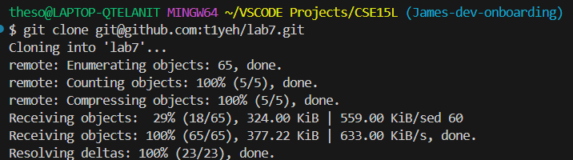

### 4. Connecting to SSH ###
 <br>
I pressed every key used to type ssh and my ieng6 server. <br>
```ssh t1yeh@ieng6.ucsd.edu``` <br>

### 5. Repo Cloning ###
 <br>
I pressed every key required to be able to git clone the ssh url <br>
```git clone``` ```<ctrl> v```(copy and paste of ssh url) <br>

### 6. Test Failing ###

I pressed every key required to be able to run the test <br>
```bash test.sh``` ```<enter>``` <br>

### 7. Editing Code File ###

1 ```/x```, ```<enter>```, 1 ```N```, 1 ```r2```, 1 ```<escape>```, 1 ```:wq``` <br>
```/x``` was to find every word containing X
```<enter>``` send query
```N``` reverse search
```r``` replacement mode
```2``` replaced 1 with 2
```<escape>``` exit
```:wq``` save and leave

### 8. Test Passing ###

I pressed every key required to be able to run the test <br>
```bash test.sh``` ```<enter>```  <br>

### 9. Commit ###

I pressed the keys needed to add the modified file and commit <br>
```git add .``` ```<enter>```
```git commit -m "message" ``` ```<enter>```
```git push``` ```<enter>```
